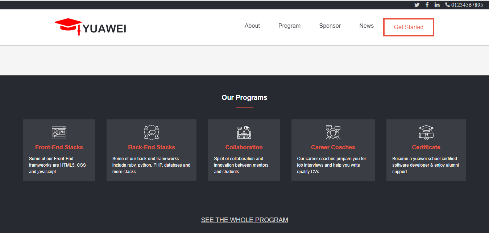
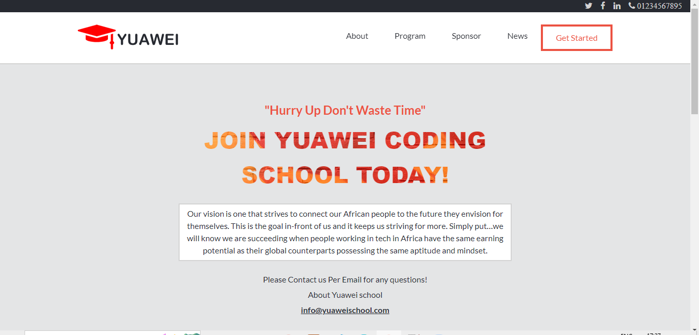
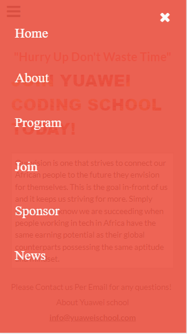
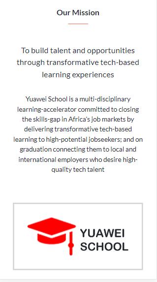

# capstoneProject-1

# Table of Contents

- About the project
- Links
- Screenshot
- Technologies
- Setup
- Status
- Credits
- Contributions
- Acknowledgments
- License

# About the Project
>  This is a HTML/CSS and javascript final capstone project done at after completing 4 weeks of CSS, HTML and Javascript learning at microverse bootcamp. The capstone project is meant to test knowledge on these stack learnt in the previous weeks.
This project is a coding bootcamp website with home and about pages. The website is responsive on both large and small devices.

### Objectives of this project

- Use semantic HTML tags.
- Apply best practices in HTML code.
- Use CSS selectors correctly.
- Use CSS box model.
- Use Flexbox to place elements in the page.
- Demonstrate ability to create UIs adaptable to different screen sizes using media queries.
- Use GitHub Pages to deploy web pages.
- Apply JavaScript best practices and language style guides in code.
- Use JavaScript to manipulate DOM elements.
- Use JavaScript events.
- Use objects to store and access data.
- Communicate technical concepts to other technical people.

# Link to live demo
- https://kessio-microverse-projects.github.io/capstoneProject-1/

# Link to Video demo

# Screenshot
- Below is screenshot of some of the website sections on mobile and desktop view
 
 
 
 
 
 
 
 

## Technologies

- HTML
- CSS
- Javascript
- Technologies used : HTML, CSS & javascript linters

## Setup

- Download or clone the repository

## Status

- Complete working website but will always be updated

## Credits

👤 **Author1**

- GitHub: [@kessio](https://github.com/kessio)
- Twitter: [@kessio_sharon](https://twitter.com/kessio_sharon)
- LinkedIn: [sharon-kessio](https://www.linkedin.com/in/sharon-kessio-172220b5)

## 🤝 Contributing

Contributions, issues, and feature requests are welcome!

### Show your support

Give a ⭐️ if you like this project!

## Acknowledgments

- Original design idea by [Cindy Shin in Behance](https://www.behance.net/adagio07)
- Thanks to microverseinc who's directory was helpful in making this project

Links to images used on testimonial section:
 - https://unsplash.com/photos/Q-AyXtCV4aQ
 - https://unsplash.com/photos/ZGa9d1a_4tA
 - https://unsplash.com/photos/nJHvhXS4C0U
 - https://unsplash.com/photos/AzVexpHvuKY
 - https://unsplash.com/photos/_5_CBVCLBsY
 - https://unsplash.com/photos/Zpzf7TLj_gA

## License

MIT license @ author

